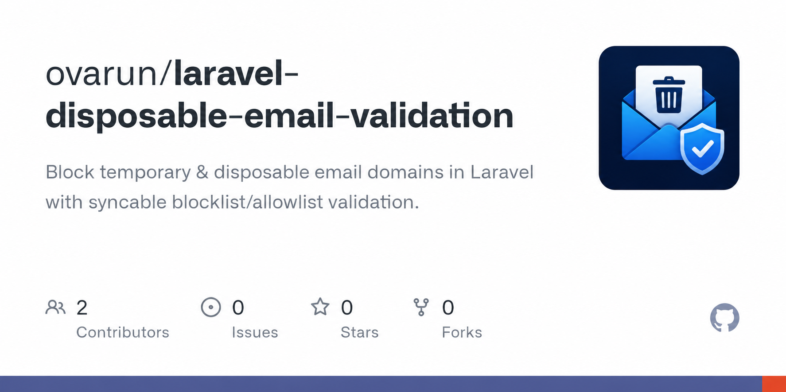

<p align="center">
    
</p>

#  Laravel Disposable Email Validator

A Laravel package to **detect and block disposable email addresses**, seeded from the [disposable-email-domains](https://github.com/disposable-email-domains/disposable-email-domains) project.
Supports a **blocklist** and an **allowlist**, with an Artisan command to sync both from upstream.

> **Requires Laravel 12+ and PHP 8.2+.** For older Laravel versions, use `^1.0` of this package.

---

## 📦 Installation

```bash
composer require ovarun/laravel-disposable-email-validation
```

The package uses **Laravel Package Auto-Discovery**, so you don't need to register the service provider manually.

---

## ⚙️ Configuration

Publish the config file (optional — sensible defaults are used otherwise):

```bash
php artisan vendor:publish --tag=config
```

This creates `config/disposable-email.php`:

```php
<?php

return [

    // Extra domains to block, on top of the bundled + synced lists.
    'blocklist' => [],

    // Domains that are always allowed, even if blocked elsewhere. Wins over blocklist.
    'allowlist' => [],

    'sync' => [
        'blocklist_url' => 'https://raw.githubusercontent.com/disposable-email-domains/disposable-email-domains/master/disposable_email_blocklist.conf',
        'allowlist_url' => 'https://raw.githubusercontent.com/disposable-email-domains/disposable-email-domains/master/allowlist.conf',
        'timeout' => 10,
        'minimum_entries' => 100,
        'disk' => 'local',
    ],

];
```

The package ships with a bundled snapshot of the upstream blocklist/allowlist (several thousand domains), so it works out of the box with **no configuration and no network access required**. The `blocklist`/`allowlist` config keys are only for your own custom additions.

---

## 🔄 Updating the Lists

Sync the latest blocklist and allowlist from upstream:

```bash
php artisan disposable-email:update
```

This fetches both lists over HTTP, validates that the response looks like a real domain list (rejecting anything with fewer than `sync.minimum_entries` valid-looking domains, to avoid corrupting your data with a bad response), and writes them atomically to:

```
storage/app/disposable-email/blocklist.json
storage/app/disposable-email/allowlist.json
```

These synced files are merged with the bundled defaults and your custom config entries every time the validator runs. **Allowlist always wins.**

### Optional: schedule it

```php
// routes/console.php or app/Console/Kernel.php
Schedule::command('disposable-email:update')->weekly();
```

---

## 🛠 Usage

### Validation Rule

```php
use Ovarun\DisposableEmail\Rules\NotDisposableEmail;

$request->validate([
    'email' => ['required', 'email', new NotDisposableEmail()],
]);
```

If the email domain is blocked, validation fails with:

```
Disposable or blocked email addresses are not allowed.
```

### Standalone Check

```php
use Ovarun\DisposableEmail\DisposableEmailValidator;

$validator = app(DisposableEmailValidator::class);

if ($validator->isDisposable('test@mailinator.com')) {
    // Handle blocked email
}
```

`DisposableEmailValidator` is registered as a container singleton, so the (potentially large) merged domain list is only built once per request/worker instead of on every validation call — resolve it via the container rather than `new`-ing it directly where possible.

---

## ⚡ What changed in v2

- Fixed the sync command: it now correctly pulls plain-text domain lists from the real upstream repository (previously it fetched this package's own `.php` config file as JSON, which silently failed).
- `DisposableEmailValidator` is bound as a container singleton and uses O(1) hash-map lookups instead of scanning the list linearly on every call.
- The bundled domain lists moved out of `config/disposable-email.php` into `resources/domains/`, so `php artisan config:cache` no longer has to load thousands of domain strings into the config cache on every request.
- `NotDisposableEmail` now implements Laravel's `Illuminate\Contracts\Validation\ValidationRule` and safely rejects non-string input instead of throwing.
- The update command validates and atomically writes synced lists, with a request timeout and a sanity check against truncated/empty responses.
- Dropped support for Laravel < 12 and PHP < 8.2.

---

## 📄 License

MIT License.
